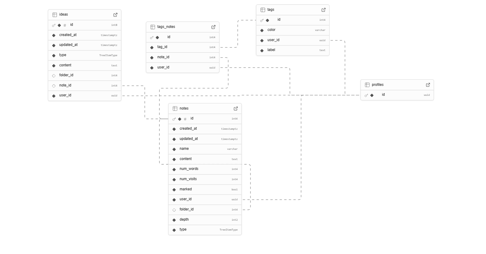

# Welcome to Think Note

:notebook: [Think Note]() is a note-taking app built with **Expo**, powered by **Supabase** and **Gemini**. It supports a hierarchical folder system, AI-generated note summaries, a rich-text editor, tag-based filtering, and much more.

# Overview

## Home screen

## Notes screen

## Ideas screen

## User profile

# Main features

- :notebook_with_decorative_cover: **Notes**
  - Rich-text editor
  - Custom tags
  - Word counter
  - Mark notes
  - Sort by creation date, update date, word count, or number of visits
  - Home page displaying note lists and uncategorized notes (notes without a folder)
  - Move a note or folder to another folder (long-press an item and choose a new parent folder)
- :robot: **AI**
  - Generate AI summaries from note content using a custom prompt
  - Automatic categorization of summaries
  - View summaries organized by categories
- :bust_in_silhouette: **User profile**
  - Sign up with email and password
  - Update your username, email, or password
  - Add a profile picture
  - View personal usage statistics

# Tech stack

## Frontend

- **Core technologies**
  - TypeScript
  - React Native
  - Expo
  - 10play/tentap-editor
- **UI**
  - React Native Paper
  - React Native Reanimated
  - Universal Gradient Text
  - React Native Render HTML
- **State**
  - Zustand
- **Forms**
  - React Hook Forms
  - Zod

## Backend

- Supabase (PostgreSQL)
- Google AI Studio (Gemini)

# Database schema



# Installation

1. Clone the repository

```bash
git clone https://github.com/yourname/think-note.git
```

2. Install dependencies

```bash
npm install
```

3. Set env variables

```
EXPO_PUBLIC_SUPABASE_SERVICE_KEY=
EXPO_PUBLIC_GEMINI_API_KEY=
```

_Note: Add the EXPO*PUBLIC* prefix in both `supabase.ts` and `geminiClient.ts`_

4. Run the project

```bash
npm run start
```

# Key considerations

If you choose to develop your own Supabase backend, you will need to create several **PostgreSQL functions and triggers**, including:

- Automatic creation of a user’s row in the profiles table
- Automatic updating of the updated_at column in the notes and ideas tables
- Automatic calculation of the total word count and number of visits in each folder
- Saving an AI-generated summary by inserting a new row or updating an existing one
- Creating and updating a note along with its tags
- Moving a note or folder to another folder

# License

This project is licensed under the MIT license.
